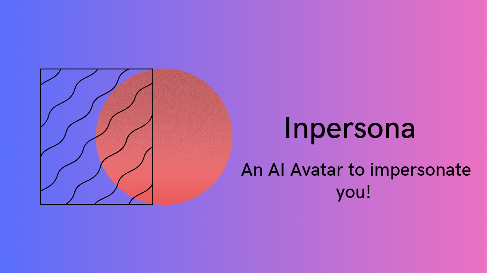
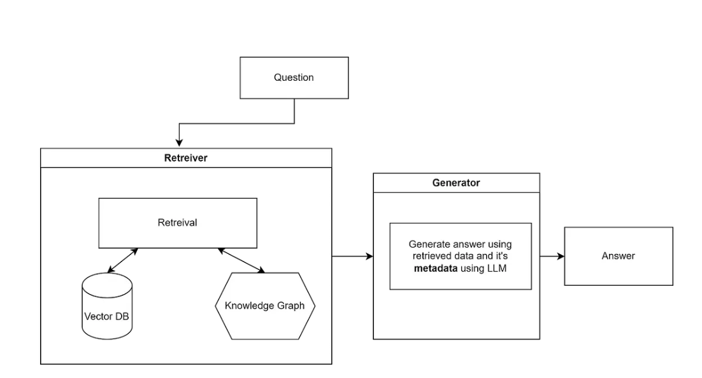
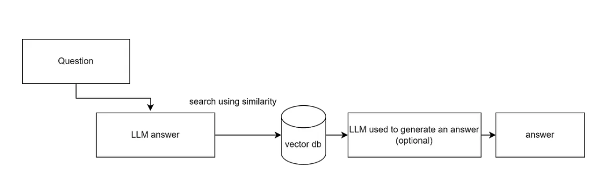

# Odyssey

Personal portfolio site for **Yatharth Kapadia**, plus **Inpersona** — a chatbot that answers as the site's owner using RAG over their documents.

<p align="center">
  
</p>

Live at <https://yatharthk.com>.

---

## Repo layout

```
odyssey/
├── frontend/               Next.js (Pages Router) site + Inpersona chat UI
│   ├── pages/
│   │   ├── index.tsx         Home page composition
│   │   ├── index.json        ← all site content (edit this, not the components)
│   │   ├── inpersona.tsx     Chat page
│   │   ├── loading.tsx       Inpersona launch screen
│   │   └── components/       Section-level components used by index.tsx
│   ├── components/         Cross-cutting components (Layout, ThemeToggle, primitives)
│   ├── hooks/              Shared React hooks (useIsMobile, …)
│   ├── types/config.ts     Typed loader over pages/index.json
│   ├── public/             Static assets (logos, photos, resume PDF)
│   └── styles/globals.css  Tailwind base + Inpersona chat animations
│
├── backend/                FastAPI + LlamaIndex RAG service
│   ├── server.py             WebSocket /chat endpoint + lifespan
│   ├── settings.py           PropertyGraphSettings (single config source)
│   ├── chat/
│   │   ├── ChatManager.py        Composition root — wires every component
│   │   ├── ModelsManager.py      Picks Groq or Gemini LLM, writes global Settings
│   │   ├── ChromaClient.py       Persistent ChromaDB collection
│   │   ├── vector_store_manager.py  Builds/loads KG + vector indices
│   │   ├── query_engine.py       Per-query streaming, HyDE wrapping, cache
│   │   ├── CacheManager.py       Redis cache with frequency-based eviction
│   │   ├── chatdata.py           Bounded chat history (deque)
│   │   └── prompt.py             ← system prompt (load-bearing, see below)
│   ├── documents/          Source corpus for RAG (e.g. resume.txt)
│   ├── storage/            Persisted KG + vector index (gitignored)
│   ├── chroma_db/          Persistent ChromaDB on-disk store (gitignored)
│   ├── pyproject.toml      Python project metadata (uv-compatible)
│   └── .python-version     Pins Python to 3.12
│
└── ivg/                    Architecture diagrams used in this README
```

---

## Frontend

### Setup

```bash
cd frontend
npm install        # legacy-peer-deps=true is set in .npmrc; required for React 19 + Next 16
npm run dev        # http://localhost:3000
```

Production builds:

```bash
npm run build
npm run start
npm run lint
```

### How content is structured

**Almost every visible string, link, list, and image path lives in `frontend/pages/index.json`.** Components read from there through the typed loader at `frontend/types/config.ts`. To change what appears on the site you rarely need to touch a component — edit the JSON.

Top-level keys in `index.json` (each maps to a section component):

| Key | Component | What it controls |
|---|---|---|
| `navigation` | `Header` | Top-nav links and labels |
| `hero` | `Hero` | Landing block name + subtitle |
| `about` | inline in `index.tsx` | About copy + portrait |
| `projects.projects[]` | `Projects` | Project tiles (title, description, github/url, image, optional `media: "openNotifAnimation"`) |
| `experience.items[]` | `Experience` | Job cards (set `iconOnly: true` for square-logo companies like Moss) |
| `skills.categories.{key}` | `Skills` | Skill chips, grouped into Languages / Technologies / Databases / Core Competencies |
| `achievements.items[]` | `Achievements` | Award tiles (`companyIcon`: `"dell"` / `"nvidia"` / `"amazon"`) |
| `testimonials.items[]` | `Testimonials` | Testimonial cards + auto-rotation |
| `contact` | inline in `index.tsx` | Formspree form copy + form ID |
| `footer` | `Footer` | Social links + credit text |
| `inpersona` | `InpersonaChat`, `InpersonaLoading` | Chat suggestions, toggle labels, WebSocket port + path, loading-screen features |

If you add a new top-level key, also extend the `Config` interface in `frontend/types/config.ts` so TypeScript picks it up.

### Common edits

- **Add a job to Experience**: append an entry to `experience.items` in `index.json`, drop the logo PNG into `frontend/public/companyLogo/`. No component change needed.
- **Update skills**: edit `skills.categories.*.items` in `index.json`. If a skill needs a non-default icon, add a mapping in `Skills.tsx`'s `iconMapping` constant.
- **Add a project**: append to `projects.projects` in `index.json`. For an image, drop it in `public/Projects/` and reference it. For a custom animated tile (like Open-Notif), use `"media": "openNotifAnimation"` and wire a new entry in the animation registry inside `Projects.tsx`.
- **Change the Inpersona welcome prompt / suggestions**: edit `inpersona.emptyStatePrompt` and `inpersona.suggestions`.
- **Theme colors / gradients**: every "purple → pink → blue" gradient flows through `components/primitives/GradientHeading.tsx`. Change it there.
- **Add a new section to the home page**: add a key under `index.json`, write a component in `pages/components/`, import it in `pages/index.tsx`, and wrap it with `<SectionCard>` so it matches the rest of the page.

### Reusable primitives

Three components in `frontend/components/primitives/` absorb the repetition:

- `<SectionCard id title>` — the glass-panel `motion.section` wrapper used by every section
- `<GradientHeading>` — the animated purple/pink/blue heading
- `<InpersonaNavLink>` — the cycling-gradient nav pill

And one shared hook at `frontend/hooks/useIsMobile.ts` for the responsive breakpoints. Use these instead of copy-pasting Tailwind class soup.

### Theme

Dark/light is React Context (`frontend/context/ThemeContext.tsx`) wrapping at `pages/_app.tsx`. The toggle button lives in the header. Theme state is stored in `localStorage` under `theme`.

---

## Backend

### Setup

The backend ships a `pyproject.toml` consumable by **uv**. You don't need to install Python yourself; uv will fetch the pinned version (3.12) the first time you sync.

```bash
cd backend
uv sync                                  # installs deps into ./.venv, generates uv.lock
cp .env.example .env                     # then fill in the two required keys
uv run python -m uvicorn server:app --reload
```

Then visit the frontend at `http://localhost:3000` — the Inpersona page will pick up the WebSocket at `ws://localhost:8000/chat` automatically (in dev it speaks `ws://`, in prod it switches to `wss://`).

### Required environment

Only two variables are mandatory. Everything else falls back to defaults in `settings.py`.

```dotenv
# backend/.env
GROQ_API_KEY=...                # https://console.groq.com/keys
Google_Gemini_API_KEY=...       # https://aistudio.google.com/app/apikey
```

Optional overrides (all map to fields on `PropertyGraphSettings`):

| Env var | Field | Default |
|---|---|---|
| `REDIS_URL` | `redis_url` | `redis://localhost:6379` (caching silently disabled if unreachable) |
| `DEFAULT_MODEL_PROVIDER` | `default_model_provider` | `groq` |
| `ALLOWED_ORIGINS` (comma-separated) | `allowed_origins` | `["*"]` |
| `HOST` / `PORT` / `WEBSOCKET_PATH` | server bind + ws path | `0.0.0.0` / `8000` / `/chat` |
| `PDF_DIRECTORY` | source corpus dir | `./documents` |
| `SSL_CERT_PATH` / `SSL_KEY_PATH` / `SSL_CA_PATH` | TLS certs (used only when running `python server.py` directly) | `/etc/ssl/yatharthk.com.*` |

For everything else — chunk sizes, model names, embedding model, `similarity_top_k`, `max_tokens`, cache size, thread pool — edit the literal in `backend/settings.py`. There's no env var for those because they don't change between dev and prod.

### Architecture in one paragraph

A single WebSocket endpoint (`/chat`) is backed by `ChatManager`, the composition root. On startup the lifespan handler builds (in order): `ModelManager` (Groq or Gemini LLM + HuggingFace `BAAI/bge-base-en-v1.5` embeddings, written into LlamaIndex's global `Settings`), `ChromaStoreManager` (persistent client at `./chroma_db`), `VectorStoreManager` (builds a `PropertyGraphIndex` and a `VectorStoreIndex` **in parallel threads** — both persist under `./storage/`, both share the Chroma collection), and `QueryEngine` (wraps each index as a streaming engine plus a HyDE-transformed variant — four engines total: `{KG, vector} × {plain, HyDE}`).

Per-query flow inside `QueryEngine.process_query`:

1. Check the Redis cache (keyed on lowercased question) — return immediately on hit.
2. Append the question to the in-memory `Chat` deque.
3. Concatenate the system prompt + the full chat history + the current question into one prompt string.
4. Pick `{KG | vector} × {HyDE | plain}` from the incoming request and stream chunks via a `Queue` populated from a worker thread (the LlamaIndex stream is sync, bridged into the async WebSocket handler).
5. Append the assembled response to the chat history and write it to the cache.

### The system prompt is load-bearing

`backend/chat/prompt.py` instructs the model to respond **as Yatharth in first person, in HTML (not Markdown)**, with strict formatting rules and a topic filter that refuses off-topic questions. The frontend renders these responses as raw HTML — changes to the prompt's output format break rendering, and changes to the frontend renderer must match the prompt's contract.

### Common edits

- **Change the chatbot personality / content rules**: edit `backend/chat/prompt.py`. Read the existing rules before changing — the HTML format and the topic filter both have downstream contracts.
- **Update the source corpus**: drop new files into `backend/documents/`, then delete `backend/storage/*` and `backend/chroma_db/*` so the next startup rebuilds the indices. (Existing files there mean "already built, load from disk.")
- **Switch default LLM**: `DEFAULT_MODEL_PROVIDER=groq` (or `gemini`) in `.env`, or change the dataclass default in `settings.py`. Clients can also override per-request via `"model_provider": "..."` in the WebSocket payload.
- **Tune retrieval**: `similarity_top_k`, `chunk_size`, `chunk_overlap`, `max_tokens` — all in `settings.py`.
- **Pin a different Gemini model**: edit `settings.py:google_model`. The current value (`models/gemini-2.0-pro-exp-02-05`) is an experimental snapshot Google has likely retired; pick a current one like `models/gemini-2.0-flash` or `models/gemini-1.5-pro-latest`.
- **Add a new dependency**: `uv add <package>`. Commit the updated `pyproject.toml` and `uv.lock`.

### Frontend ↔ backend contract

WebSocket request shape:

```json
{
  "question": "...",
  "vector_store": "KG" | "vector",
  "query_transformation": "HyDE" | null,
  "model_provider": "groq" | "gemini"
}
```

Server response is JSON-per-frame:

- `{"type": "chunk", "content": "..."}` — repeated streaming chunks
- `{"type": "complete"}` — terminator
- `{"error": "..."}` — on failure

If the client sends a `model_provider` different from the current one, the server serializes a rebuild of `ChatManager` under a lock; concurrent clients keep talking to the live one until the swap finishes.

### CLI client (handy for debugging)

```bash
uv run python client.py        # interactive prompts, talks to ws://localhost:8000
```

---

## End-to-end local development

```bash
# terminal 1
cd backend
uv sync                                          # one-time
uv run python -m uvicorn server:app --reload     # http://localhost:8000

# terminal 2
cd frontend
npm install                                       # one-time
npm run dev                                       # http://localhost:3000
```

Open `http://localhost:3000`, click **Inpersona** in the nav. The chat page connects to `ws://localhost:8000/chat` automatically — protocol is derived from the page's scheme so dev (http) speaks `ws` and prod (https) speaks `wss`.

---

## Tests

There is no test runner in either package — the project is small enough that the manual loop (edit, save, hot-reload, click) is the fastest feedback. The Python `__main__` blocks in `client.py` are the closest thing to integration tests; they hit the live WebSocket.

---

## Stack reference

**Frontend**: TypeScript, React 19, Next.js 16 (Pages Router), Tailwind CSS, framer-motion, lucide-react / react-icons. The `.npmrc` `legacy-peer-deps=true` flag is required because some deps (e.g. `@formspree/react`, `react-markdown` v8) haven't published React-19-compatible peer ranges yet — don't delete it.

**Backend**: Python 3.12, FastAPI, LlamaIndex (`llama-index-core==0.11.19` and friends — pinned because the API churned heavily across minor releases), HuggingFace `BAAI/bge-base-en-v1.5` embeddings, ChromaDB, Redis (optional), Groq + Gemini LLMs.

### How the RAG pieces fit together

<p align="center">
  <strong>Knowledge graph retrieval</strong><br>
  
</p>

<p align="center">
  <strong>HyDE query transformation</strong><br>
  
</p>

---

## License

MIT — see [LICENSE](LICENSE).
